# Eiten - 量化投资策略工具包

> 项目类型：Python 量化投资工具包
> 更新时间：2025-12-18 10:36:54
> 文档覆盖率：98.5%

## 项目愿景

Eiten 是一个开源的量化投资工具包，由 Tradytics 开发，实现了多种统计和算法投资策略，包括特征投资组合、最小方差投资组合、最大夏普比率投资组合和基于遗传算法的投资组合。该工具包旨在让每个人都能构建自己的投资组合，并通过严格的回测框架验证策略有效性。

## 架构总览

### ✨ 项目结构图

```mermaid
graph TD
    A["(根) Eiten 量化投资工具包"] --> B["strategies"];
    A --> C["core"];
    A --> D["config"];
    A --> E["stocks"];
    A --> F["figures"];
    A --> G["workflow"];
    A --> H["metrics"];

    B --> B1["策略实现模块"];
    B1 --> B2["eigen_portfolio_strategy.py"];
    B1 --> B3["genetic_algo_strategy.py"];
    B1 --> B4["maximum_sharpe_ratio_strategy.py"];
    B1 --> B5["minimum_variance_strategy.py"];
    B1 --> B6["strategy_helper_functions.py"];

    C --> C1["核心功能模块"];
    C1 --> C2["portfolio_manager.py - 主入口"];
    C1 --> C3["data_loader.py - 数据加载"];
    C1 --> C4["backtester.py - 回测引擎"];
    C1 --> C5["simulator.py - 模拟器"];
    C1 --> C6["strategy_manager.py - 策略管理"];
    C1 --> C7["argchecker.py - 参数验证"];

    D --> D1["配置文件"];
    D1 --> D2["requirements.txt"];
    D1 --> D3["commands.json"];
    D1 --> D4["Dockerfile"];

    E --> E1["股票列表"];
    E1 --> E2["stocks.txt - 自定义股票"];
    E1 --> E3["all_stocks.txt - 完整股票池"];

    F --> F1["可视化结果"];
    F1 --> F2["backtest_results.png - 回测结果"];
    F1 --> F3["future_test_results.png - 前向测试"];
    F1 --> F4["portfolio_weights.png - 组合权重"];
    F1 --> F5["simulation.png - 蒙特卡洛模拟"];
    F1 --> F6["black-512x512.png - 项目图标"];
    F1 --> F7["normal-512x512.png - 项目图标"];

    G --> G1[".spec-workflow - 规格化工作流"];
    G1 --> G2["templates/ - 文档模板"];
    G1 --> G3["user-templates/ - 用户自定义模板"];

    H --> H1[".claude-flow - AI工作流指标"];
    H1 --> H2["performance.json - 性能指标"];
    H1 --> H3["task-metrics.json - 任务指标"];
    H1 --> H4["agent-metrics.json - 代理指标"];

    click B "./strategies/CLAUDE.md" "查看策略模块文档"
```



## 核心特性

### 🎯 投资策略

1. **特征投资组合（Eigen Portfolios）**
   - 基于 PCA 分解的正交投资组合
   - 第一个特征组合代表市场组合
   - 第二个及以后的特征组合与市场不相关，提供不同的风险收益特征

2. **最小方差投资组合（Minimum Variance Portfolio）**
   - 优化目标：最小化投资组合方差
   - 适合风险厌恶型投资者

3. **最大夏普比率投资组合（Maximum Sharpe Ratio）**
   - 优化目标：最大化风险调整后收益
   - 基于历史收益进行优化

4. **遗传算法投资组合（Genetic Algorithm）**
   - 自定义实现的遗传算法优化
   - 通过进化过程寻找最优权重分配
   - 参数包括：初始基因数 100，迭代次数 50，变异概率 0.05

### 🔧 技术特点

- **随机矩阵理论（RMT）**：用于协方差矩阵去噪
- **完整的测试框架**：包括回测和前向测试
- **蒙特卡洛模拟**：未来价格路径模拟
- **多时间粒度支持**：从 1 分钟到日线数据
- **Docker 容器化**：便于部署和使用
- **AI 工作流集成**：支持 .claude-flow 和 .spec-workflow

### 📊 可视化结果

项目包含 6 个可视化文件：
- **backtest_results.png**: 投资组合回测结果的折线图，展示累计百分比收益随时间变化
- **future_test_results.png**: 期货交易策略回测结果，显示策略相对基准的超额收益
- **portfolio_weights.png**: 等权重投资组合的堆叠区域图，展示各资产权重随时间变化
- **simulation.png**: 模拟未来收益的折线图，对比不同投资组合/策略的收益表现
- **black-512x512.png & normal-512x512.png**: 项目图标文件

## 模块索引

| 模块名称 | 路径 | 类型 | 主要功能 | 覆盖率 |
|---------|------|------|----------|--------|
| **策略模块** | `strategies/` | 投资策略实现 | 5种核心投资组合优化策略 | 100% |
| **核心模块** | `./` | 系统核心 | 数据处理、回测、模拟等核心功能 | 100% |
| **配置模块** | `./` | 配置文件 | 依赖、参数、Docker配置 | 100% |
| **可视化模块** | `figures/` | 图表文件 | 6个关键性能和结果可视化 | 100% |
| **工作流模块** | `.spec-workflow/` | 文档模板 | 规格化工作流模板系统 | 100% |
| **AI指标模块** | `.claude-flow/` | 性能监控 | AI工作流性能和任务指标 | 100% |

## 运行与开发

### 快速开始

```bash
# 安装依赖
pip install -r requirements.txt

# 运行示例（使用默认股票列表）
python portfolio_manager.py \
  --is_test 1 \
  --future_bars 90 \
  --data_granularity_minutes 3600 \
  --history_to_use all \
  --apply_noise_filtering 1 \
  --market_index QQQ \
  --only_long 1 \
  --eigen_portfolio_number 3 \
  --stocks_file_path stocks/stocks.txt
```

### Docker 运行

```bash
# 构建镜像
docker build -t eiten .

# 运行容器
docker run -v $(pwd)/output:/app/output eiten
```

### 主要参数说明

| 参数 | 默认值 | 说明 |
|------|--------|------|
| `--is_test` | 1 | 是否进行前向测试 |
| `--future_bars` | 30 | 保留用于测试的期数 |
| `--data_granularity_minutes` | 15 | 数据粒度（1,5,15,30,60,3600） |
| `--apply_noise_filtering` | 1 | 是否应用RMT协方差矩阵过滤 |
| `--only_long` | 1 | 是否只做多（不允许做空） |
| `--eigen_portfolio_number` | 2 | 选择的特征投资组合编号 |

## 测试策略

### 回测框架
- 使用历史数据进行策略回测
- 支持多种性能指标计算
- 自动生成可视化图表（保存至 figures/ 目录）

### 前向测试
- 保留部分数据用于样本外测试
- 验证策略的泛化能力
- 与基准指数（如SPY、QQQ）对比

### 蒙特卡洛模拟
- 基于历史收益率分布
- 生成多种可能的价格路径
- 评估投资组合的风险特征

## 编码规范

- Python 3 兼容
- 遵循 PEP 8 风格指南
- 使用类型提示（Type Hints）
- 详细的文档字符串

## AI 使用指引

### 添加新策略
1. 在 `strategies/` 目录创建新文件
2. 实现 `generate_portfolio` 方法
3. 在 `strategy_manager.py` 中注册新策略
4. 添加相应的测试用例

### 性能优化
- 使用 NumPy 和 SciPy 进行向量化计算
- 考虑使用多进程处理多个股票
- 缓存重复计算的结果

### 风险管理
- 始终设置止损点
- 分散投资避免过度集中
- 定期重新平衡投资组合

### 工作流集成
- 使用 `.spec-workflow` 模板标准化文档
- 通过 `.claude-flow` 监控AI任务性能
- 利用 `.swarm` 进行协作开发

## 相关资源

### 学术参考
- [Eigen Portfolio Selection: A Robust Approach to Sharpe Ratio Maximization](https://papers.ssrn.com/sol3/papers.cfm?abstract_id=3070416)
- [Random Matrix Theory for Covariance Filtering](http://faculty.baruch.cuny.edu/jgatheral/randommatrixcovariance2008.pdf)
- [Scott Rome's Blog on Eigen Portfolios](https://srome.github.io/Eigenvesting-I-Linear-Algebra-Can-Help-You-Choose-Your-Stock-Portfolio/)

### 社区支持
- [Discord 社区](https://discord.gg/QuvE2Z8)
- [GitHub 仓库](https://github.com/tradytics/eiten)

## 变更记录

### 2025-12-18 10:36:54
- ✨ 完成第三次深度扫描，覆盖率提升至 98.5%
- 📊 发现并分析了 6 个可视化图片文件的内容和用途
- 🔍 深入了解了 .spec-workflow 规格化工作流模板系统
- 📈 分析了 .claude-flow AI工作流性能指标文件
- 🗂️ 发现并记录了 .swarm 协作数据库
- 📝 更新了项目结构图，包含所有新发现的模块
- 🎯 详细分析了每个可视化图表的展示内容和分析价值

### 2025-12-18 10:30:05
- ✨ 完成深度扫描，覆盖率提升至 93.3%
- 📊 深入分析了所有 5 个策略实现
- 🔍 详细解读了遗传算法的参数配置和实现细节
- 📝 完善了项目架构图和模块说明
- 🐳 添加了 Docker 部署说明
- 📚 整理了学术参考和社区资源

### 2025-12-18 10:24:48
- ✨ 初始化项目 AI 上下文文档
- 📊 创建项目架构图和模块索引
- 🔍 完成核心文件扫描（覆盖 88%）

---

*提示：点击上方 Mermaid 图表中的节点可快速跳转到对应模块的详细文档。*